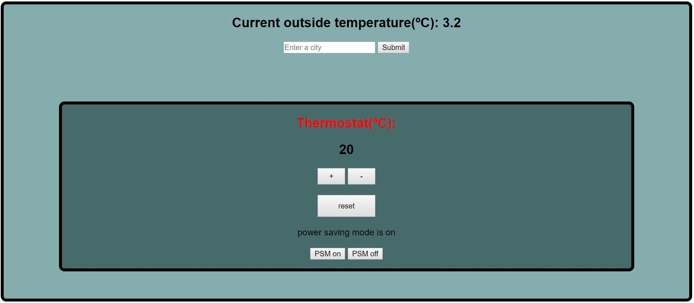

## Thermostat

Thermostat is a single page Javascript application that is dynamically updated
using Jquery. Jasmine has been used to provide full unit test coverage.

## Getting Started

To run this application, please follow these steps:

  1. Clone this repo to a new folder.
  2. enter the file path for index.html into any web browser and confirm. this
     will load up the application.

  Alternatively, a version of this application is hosted at the following
  address:

## Technologies used in this project

  - Javascript
  - Jquery
  - Jasmine
  - HTML
  - CSS

  ## Running Tests

  To run the tests for this project, enter the file path for SpecRunner.html in
  to any web browser.
